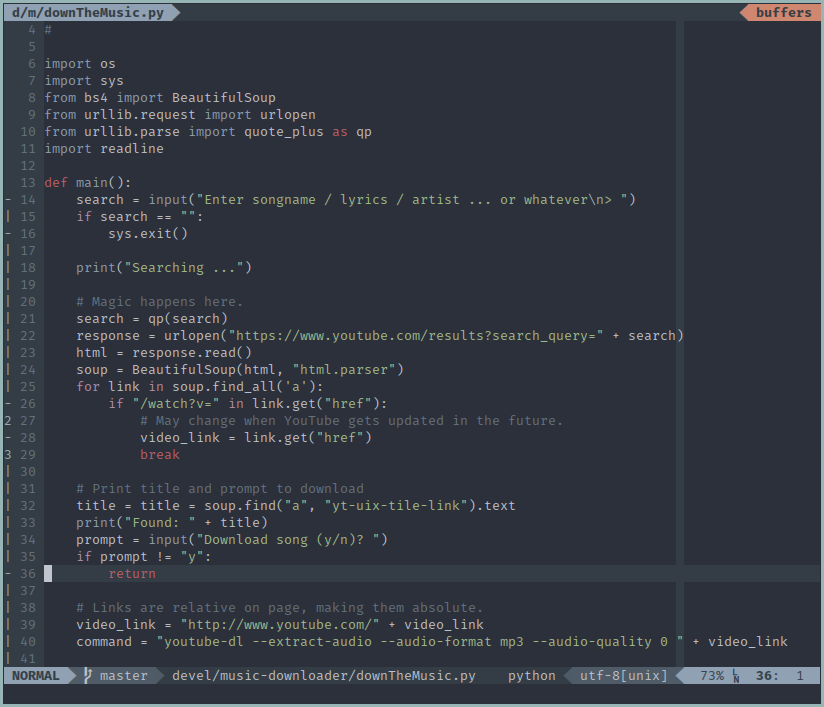
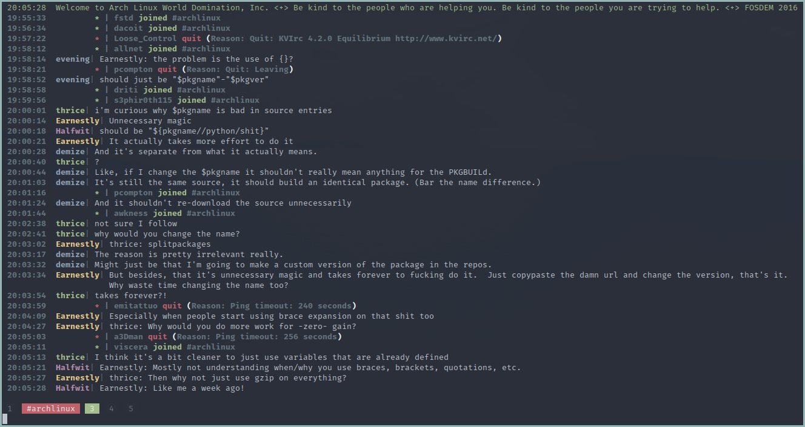

# dotfiles
Configuration files for my Arch Linux system

### Screenshots
Base16-ocean theme:

#### i3

#### vim

#### irssi


### Installation

```
 git clone https://github.com/aouelete/dotfiles.git
 git submodule update --init --recursive
```

Use the bash script ```stow.sh``` to install dotfiles by creating symlinks to the proper directories (gnu-stow must be installed).

Script usage:

```
./stow <pack1> [<pack2> ...]    create symlinks for specified packages
./unstow <pack1> [<pack2> ...]  remove symlinks for specified packages
./restow <pack1> [<pack2> ...]  remove and then recreate symlinks for specified packages
```

This script will read the file ```index``` to determine which files go where. 

File format for ```index```:

One package per line, does not have to be in alphabetical order.

```
<package name>: <directory>
<package2>: <directory>
...
```

