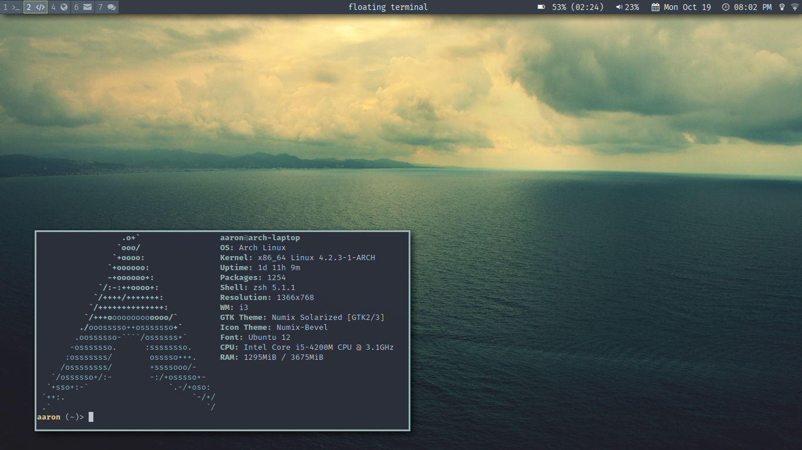
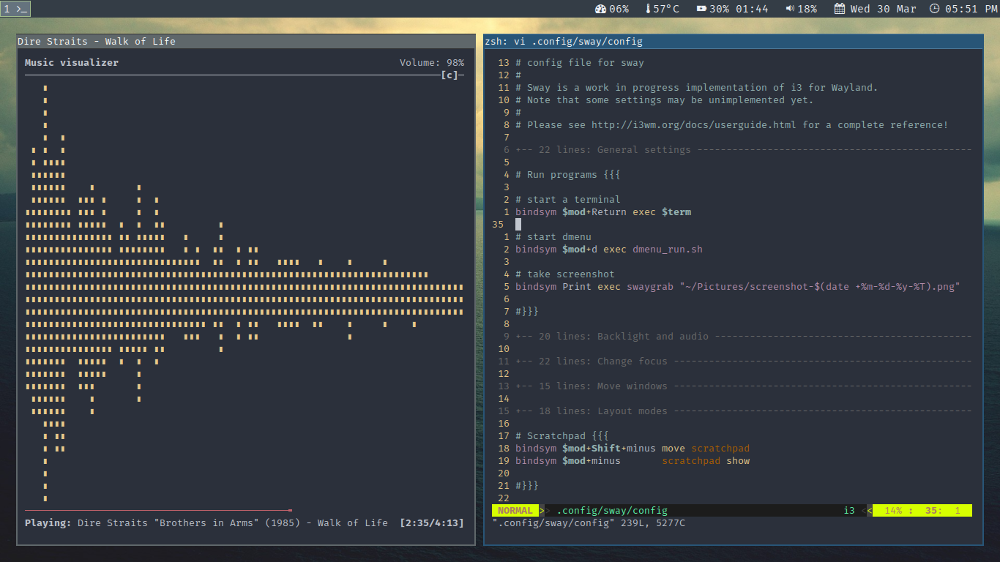
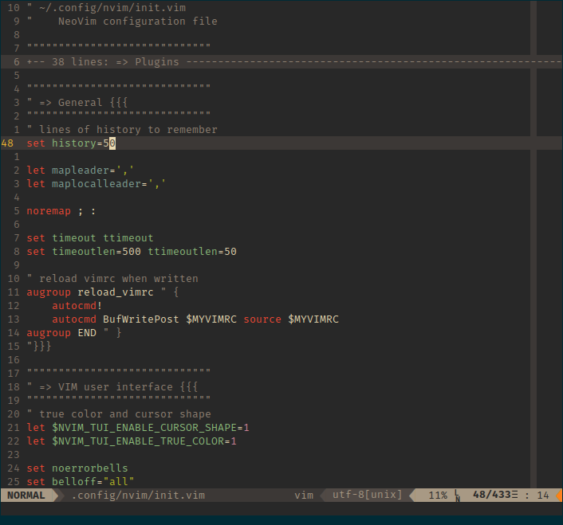

# dotfiles
Configuration files for my Arch Linux system

### Screenshots

#### i3

#### sway

#### neovim


### Installation

```
 git clone https://github.com/aouelete/dotfiles.git
 git submodule update --init --recursive
```

Use the bash script ```stow.sh``` to install dotfiles by creating symlinks to the proper directories (gnu-stow must be installed).

Script usage:

```
./stow <pack1> [<pack2> ...]    create symlinks for specified packages
./unstow <pack1> [<pack2> ...]  remove symlinks for specified packages
./restow <pack1> [<pack2> ...]  remove and then recreate symlinks for specified packages
```

This script will read the file ```index``` to determine which files go where.

File format for ```index```:

One package per line, does not have to be in alphabetical order.

```
<package name>: <directory>
<package2>: <directory>
...
```

### Apps included and their dependencies

#### NeoVim
* python-neovim and python2-neovim for python plugins
* xsel for integration with the X clipboard

Plugins listed in the init.vim file must be present for it to work.
* YouCompleteMe also needs clang and boost to work.

#### i3
* i3blocks for status bar
* i3lock and xautolock for screen lock
* compton for transpareency and other effects
* dunst - notification daemon
* xcape - to remap CapsLock to Esc and Ctrl

#### mutt
* sidebar patch
* urlview for opening urls in a browser
* gnupg for encrypting/signing emails

#### Git
* diff-so-fancy for fancy diffs

#### Sway
* i3status for status bar
* light - backlight control that does not depend on X


### Inspiration
Here are some other dotfile repositories that I got some ideas from (also some interesting setups or utilities):

* [xero/dotfiles](https://github.com/xero/dotfiles)
* [dylanaraps/fetch](https://github.com/dylanaraps/fetch)
* others ...

